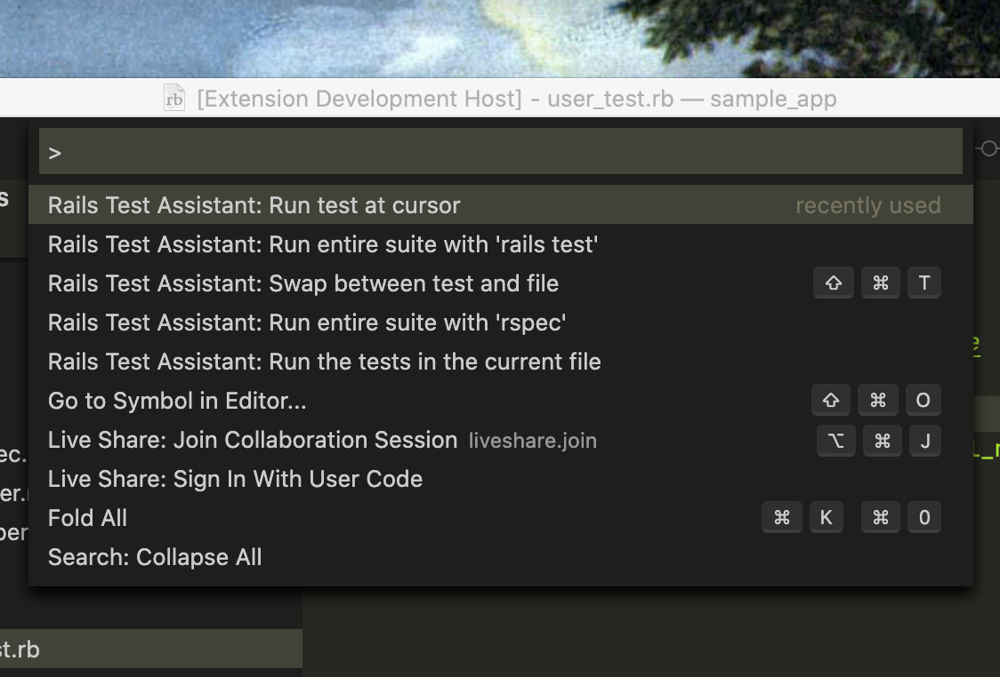

# Rails Test Assistant

## Features

* **Easy navigation** between a class and its test.
* Execute the current test, the current file, or all tests in the project.
* Works with Test::Unit, MiniTest and RSpec.

## Extension Settings

This extension contributes the following settings:

* `railsTestAssistant.testCommandPrefix`: Prefix the `rails test` command to suit your environment. For example, a prefix of `docker-compose run --rm web` would direct the test command to your `web` docker container.
